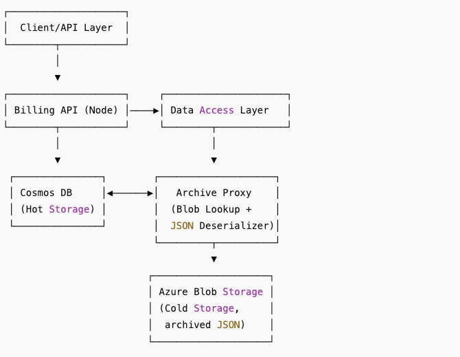

# Cost optimization

Questtion: https://gist.github.com/vikas-t/724da4a118612a8a8faf0acd5e4e4567

=======================================================

Solution:

    Goals Met:

    Cost optimization: Move infrequently accessed data to cheaper storage.

    No API changes: API layer handles data source switching.

    No downtime / data loss: Seamless migration via batch jobs and background sync.

    Simple deployment: Azure Functions, Blob Storage, and Timer Triggers.

=======================================================

Architecture Diagram

=======================================================

Cost Optimization Strategy

1. Archival Process
Move billing records older than 3 months from Cosmos DB to Azure Blob Storage (Cool or Archive tier).

Store each record as a single .json file using partitioned folder structure (e.g., /yyyy/mm/dd/recordId.json).

Maintain metadata or use a small Cosmos “index” collection to track archived records.

2. Access Layer Logic
API reads first from Cosmos DB.

If record is not found and marked archived, it retrieves from Blob Storage and deserializes the result.

Writes always go to Cosmos DB.

=======================================================

Implementation Details

Azure Services Used:
Cosmos DB: Retains recent records (< 90 days).

Blob Storage: Cold storage for JSON-formatted archived records.

Azure Function App: Timer-triggered archival job + HTTP-triggered retrieval proxy.

Azure Table (optional): Archive index for fast lookup.

=======================================================

Core Logic – Pseudocode & Scripts

scripts/archive_function.py  --> Archival Function (Timer Trigger)

scripts/archive_retrieval.py  --> Archive-Aware Retrieval (Read Proxy)

=======================================================

Deployment Steps

Create Blob Storage with Cool tier.

Implement Timer Trigger Function to archive Cosmos DB records older than 90 days.

Update API Read Logic (internally) to fallback on archived storage.

Monitor storage and access logs to confirm reduced Cosmos usage.

=======================================================

Benefits Recap

Feature	Description

✅ Cost Optimization	Reduces Cosmos DB storage & RU costs.

✅ No API Changes	Transparent to upstream services.

✅ No Downtime	Archival runs in the background.

✅ Simple Deployment	All done with Azure-native services.

✅ Easily Extendable	Can later add backup, audit, rehydration, etc.

=======================================================

Terraform template that provisions the following Azure resources:

Resource Group

Cosmos DB account and SQL container

Azure Storage Account for archived billing records

Azure Function App (Linux, Python 3.9)

Storage Account for the Function App

=======================================================

Python-based Azure Function for archiving old billing records into blob storage.

ZIP-Ready Azure Function App (archive_old_records)

    Project Structure

archive_old_records/
├── archive_old_records/
│   ├── __init__.py
│   ├── function.json
│   └── requirements.txt
└── host.json

Replace placeholders in __init__.py with actual keys.

Zip the archive_old_records folder.

Deploy to the Function App provisioned via Terraform using Azure CLI:

command : func azure functionapp publish <function-app-name> --python

=======================================================

Retrieval Function logic to fetch billing records either from Cosmos DB or Blob Storage transparently

Retrieval Azure Function (HTTP Trigger)

    Project Structure

retrieve_billing_record/
├── retrieve_billing_record/
│   ├── __init__.py
│   ├── function.json
│   └── requirements.txt
└── host.json

=======================================================
Required GitHub Secrets

Add the following secrets to your repository:

AZURE_FUNCTIONAPP_PUBLISH_PROFILE → From archive function Azure Portal → Get publish profile

AZURE_FUNCTIONAPP_PUBLISH_PROFILE_2 → For retrieval function

=======================================================

Summary

You now have:

✅ Archival Function App (Timer-triggered)

✅ Retrieval Function App (HTTP-triggered)

✅ Infrastructure via Terraform

✅ CI/CD Pipeline via GitHub Actions

=======================================================